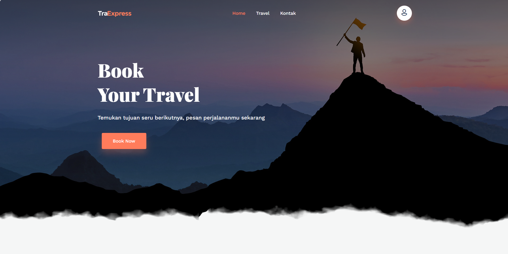
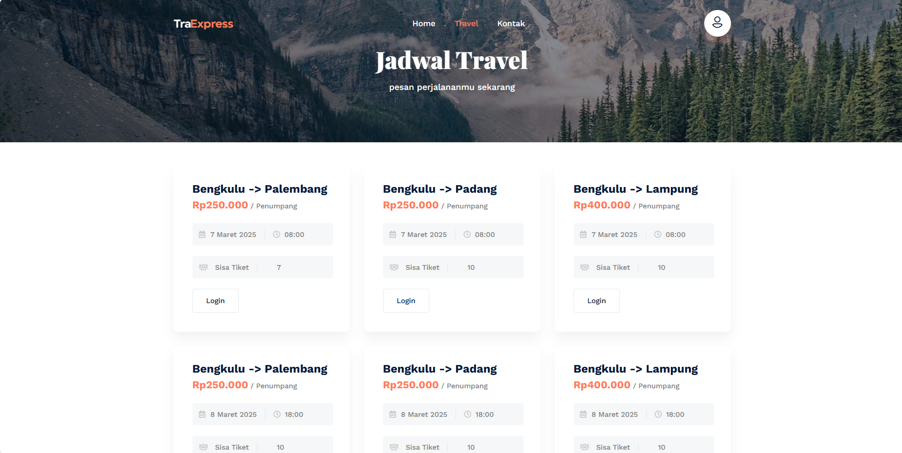
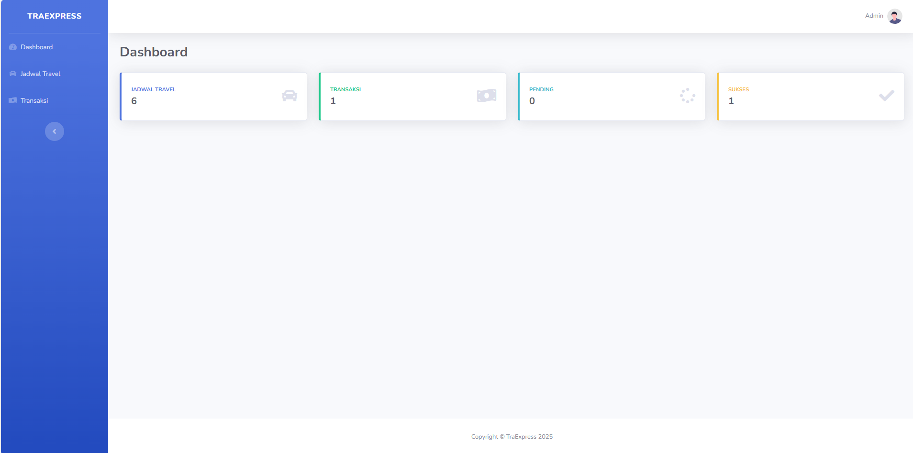

<!--
*** Thanks for checking out the Best-README-Template. If you have a suggestion
*** that would make this better, please fork the repo and create a pull request
*** or simply open an issue with the tag "enhancement".
*** Thanks again! Now go create something AMAZING! :D
-->


<!-- PROJECT SHIELDS -->
<!--
*** I'm using markdown "reference style" links for readability.
*** Reference links are enclosed in brackets [ ] instead of parentheses ( ).
*** See the bottom of this document for the declaration of the reference variables
*** for contributors-url, forks-url, etc. This is an optional, concise syntax you may use.
*** https://www.markdownguide.org/basic-syntax/#reference-style-links
--> 


<!-- PROJECT LOGO -->
<br />
<p align="center">
  <a href="https://github.com/refkijorgiprdna/traexpress-app">
    
  </a>

  <h3 align="center">SISTEM INFORMASI PEMESANAN TIKET TRAVEL</h3>

  <p align="center"> 
    <br />
    <br />
    <br /> 
  </p>
</p>


<!-- TABLE OF CONTENTS -->
<details open="open">
  <summary>Table of Contents</summary>
  <ol>
    <li>
      <a href="#about-the-project">About The Project</a>
      <ul>
        <li><a href="#built-with">Built With</a></li>
      </ul>
    </li>
    <li>
      <a href="#getting-started">Getting Started</a>
      <ul>
        <li><a href="#installation">Installation</a></li>
      </ul>
    </li>
  </ol>
</details>


<!-- ABOUT THE PROJECT -->
## About The Project




 

### Built With

This section should list any major frameworks that you built your project using. Leave any add-ons/plugins for the acknowledgements section. Here are a few examples.
Tools and Framework
* [Laravel 10](https://laravel.com)
* [PHP 8.1.10](https://php.net)
* [Laragon](https://laragon.org/)

Library/Plugin
* [Bootstrap](https://getbootstrap.com)

<!-- GETTING STARTED -->
## Getting Started 

### Installation

Ikuti langkah-langkah berikut untuk menjalankan aplikasi ini secara lokal:

### 1. Clone Repository
```bash
git clone https://github.com/refkijorgiprdna/traexpress-app.git
cd repository
```

### 2. Install Dependensi
```bash
composer install 
```

### 3. Konfigurasi Environment
Buat file `.env` dari `.env.example` dan sesuaikan konfigurasi database:
```bash
cp .env.example .env
```
Lalu edit file `.env` dan sesuaikan pengaturan database:
```
DB_CONNECTION=mysql
DB_HOST=127.0.0.1
DB_PORT=3306
DB_DATABASE=nama_database
DB_USERNAME=root
DB_PASSWORD=
```

### 4. Import Database
Jika database sudah disediakan dalam file `.sql`, ikuti langkah berikut:

1. Buka **phpMyAdmin**
2. Buat database baru dengan nama yang sesuai di `.env`
3. **Import file .sql** melalui phpMyAdmin atau terminal:

   **Via phpMyAdmin:**
   - Pilih database yang dibuat
   - Klik **Import** → Pilih file `.sql` → Jalankan

### 5. Generate Key
```bash
php artisan key:generate
```

### 6. Menjalankan Server
```bash
php artisan serve
```
Aplikasi dapat diakses melalui `http://127.0.0.1:8000`
